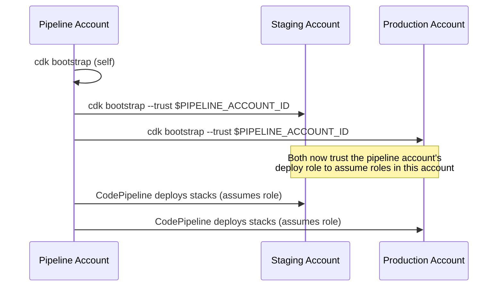

# Cross-Account Bootstrap

The pipeline lives in one account, but `stag` and `prod` deploy into
**separate AWS accounts**. Before that can work, each target account has to
explicitly **trust** the pipeline account.



## The commands

```bash
# Pipeline account (self — also used for feature + dev)
npx cdk bootstrap aws://$PIPELINE_ACCOUNT_ID/$PIPELINE_REGION \
  --qualifier rnvdevops \
  --toolkit-stack-name CDKToolkit-rnvdevops \
  --cloudformation-execution-policies arn:aws:iam::aws:policy/AdministratorAccess

# Staging account
npx cdk bootstrap aws://$STAG_ACCOUNT_ID/$PIPELINE_REGION \
  --qualifier rnvdevops \
  --toolkit-stack-name CDKToolkit-rnvdevops \
  --trust $PIPELINE_ACCOUNT_ID \
  --cloudformation-execution-policies arn:aws:iam::aws:policy/AdministratorAccess

# Production account
npx cdk bootstrap aws://$PROD_ACCOUNT_ID/$PIPELINE_REGION \
  --qualifier rnvdevops \
  --toolkit-stack-name CDKToolkit-rnvdevops \
  --trust $PIPELINE_ACCOUNT_ID \
  --cloudformation-execution-policies arn:aws:iam::aws:policy/AdministratorAccess
```

## Three things every command has, and why

- **`--qualifier rnvdevops`** — a custom qualifier, so the bootstrap
  resources (S3 bucket, ECR repo, IAM roles) are distinctly named per
  organization/convention rather than the CDK default `hnb659fds`. **Every
  account must use the same qualifier**, or the pipeline won't find matching
  roles when it tries to assume them cross-account.
- **`--toolkit-stack-name CDKToolkit-rnvdevops`** — pairs with the qualifier,
  keeping the bootstrap CloudFormation stack name consistent and
  identifiable across accounts.
- **`--trust $PIPELINE_ACCOUNT_ID`** — only needed on **target** accounts
  (stag, prod), not the pipeline account itself. This is what actually
  grants the pipeline account permission to assume deploy roles here.

:::danger AdministratorAccess is broad
`--cloudformation-execution-policies
arn:aws:iam::aws:policy/AdministratorAccess` gives the CDK deploy role full
admin rights in that account. That's a common starting point, but for
production environments many teams tighten this to a scoped policy once
they know exactly what the pipeline needs to create/update/delete.
:::

## Order matters

Bootstrap the **pipeline account first**. The target accounts' `--trust`
flag references `$PIPELINE_ACCOUNT_ID`, but more importantly, you generally
want the orchestrating account's own toolkit stack in place before wiring up
trust relationships pointing at it.

Next: [Troubleshooting →](/troubleshooting)
