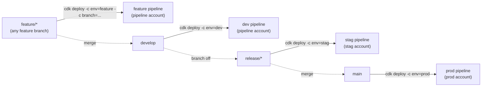

# Environment Mapping

Four environments, each backed by a Git branch pattern and (mostly) its own
AWS account:

| Env | Account | Branch | Approval | Purpose |
|---|---|---|---|---|
| `feature` | pipeline account | `feature/*` (passed via CLI) | No | Isolated feature testing |
| `dev` | pipeline account | `develop` | Yes | Integration |
| `stag` | stag account | `release/*` (set in config) | Yes | Pre-production |
| `prod` | prod account | `main` | Yes | Production |

## Key things to notice

1. **`feature` and `dev` both live in the pipeline account.** Only `stag` and
   `prod` deploy cross-account. That keeps early iteration cheap (no
   cross-account bootstrap needed) while still isolating pre-prod and prod.
2. **`feature` has no fixed branch.** You pass `-c branch=feature/xxx` on the
   CLI, which lets you run **multiple feature pipelines in parallel** — one
   per branch, uniquely named.
3. **`stag`'s branch isn't fixed either** — you edit `environments.ts` to
   point at the release branch you're cutting (e.g. `release/1.0.0`) before
   deploying. This is deliberate: staging tracks *a specific release
   candidate*, not "whatever is newest."
4. **Approval gates** are on for everything except `feature`. Feature
   pipelines are meant for fast iteration, so nothing blocks on a manual
   approve.

## Where this is configured

All of this lives in `lib/config/environments.ts`. Each environment entry
defines the branch, target account/region, VPC CIDR, EKS cluster name, and
whether approval is required. Changing an environment's behavior means
editing this one file — nothing about the pipeline stack logic needs to
change for routine adjustments like "bump the cluster name" or "flip
approval off."

Next: [Project Structure →](/project-structure)
