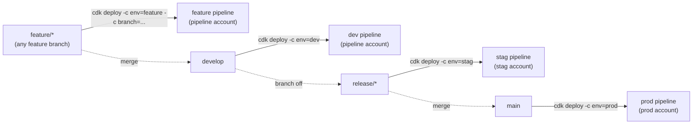

# Environment Mapping

Four environments, each backed by a Git branch pattern and (mostly) its own
AWS account:

| Env | Account | Branch | Approval | Purpose |
|---|---|---|---|---|
| `feature` | pipeline account | `feature/*` (passed via CLI) | No | Isolated feature testing |
| `dev` | pipeline account | `develop` | Yes | Integration |
| `stag` | stag account | `release/*` (set in config) | Yes | Pre-production |
| `prod` | prod account | `main` | Yes | Production |

## Key things to notice

1. **`feature` and `dev` both live in the pipeline account.** Only `stag` and
   `prod` deploy cross-account. That keeps early iteration cheap (no
   cross-account bootstrap needed) while still isolating pre-prod and prod.
2. **`feature` has no fixed branch.** You pass `-c branch=feature/xxx` on the
   CLI, which lets you run **multiple feature pipelines in parallel** — one
   per branch, uniquely named.
3. **`stag`'s branch isn't fixed either** — you edit `environments.ts` to
   point at the release branch you're cutting (e.g. `release/1.0.0`) before
   deploying. This is deliberate: staging tracks *a specific release
   candidate*, not "whatever is newest."
4. **Approval gates** are on for everything except `feature`. Feature
   pipelines are meant for fast iteration, so nothing blocks on a manual
   approve.

## What actually runs in each environment

Environments don't just differ by branch and account — `environments.ts`
also toggles which Helm charts the K8s Stack installs, and which VPC egress
mode each environment uses:

| Env | VPC egress | ArgoCD | Ingress NGINX | ALB Controller | Karpenter |
|---|---|---|---|---|---|
| `feature` | NAT Gateway | ❌ disabled | ❌ disabled | ✅ | ✅ |
| `dev` | NAT Gateway | ✅ | ✅ | ✅ | ✅ |
| `stag` | Transit Gateway | ✅ (pinned version) | ❌ disabled | ✅ | ✅ |
| `prod` | Transit Gateway | ✅ (pinned version) | ❌ disabled | ✅ | ✅ |

Two things worth calling out:

- **`feature` skips ArgoCD and Ingress NGINX entirely.** A feature pipeline
  exists to test infrastructure changes quickly — it doesn't need the full
  GitOps/app-delivery layer running, which also makes feature environments
  cheaper and faster to stand up and tear down.
- **`stag` and `prod` never run Ingress NGINX.** In those environments, the
  AWS Load Balancer Controller creates ALBs directly from Kubernetes
  `Ingress` resources — there's no separate in-cluster ingress controller.
  Only `dev` runs Ingress NGINX, likely for local/internal testing patterns
  that don't need an actual ALB per change.
- **`stag` and `prod` pin `addonVersions`** for every core EKS addon
  (`vpc-cni`, `coredns`, `kube-proxy`, the CSI drivers, `metrics-server`) to
  exact versions, while `feature`/`dev` float to latest. That's a deliberate
  trade-off: faster iteration in lower environments, reproducible/tested
  versions in the environments that matter most.

## Where this is configured

All of this lives in `lib/config/environments.ts`. Each environment entry
defines the branch, target account/region, VPC CIDR, EKS cluster name,
approval requirement, and the `helmCharts` block controlling ArgoCD/Ingress
NGINX/ALB Controller/Karpenter versions and values. Changing an
environment's behavior means editing this one file — nothing about the
pipeline stack logic needs to change for routine adjustments like "bump the
cluster name," "flip approval off," or "enable ArgoCD in staging."

Next: [Project Structure →](/project-structure)
