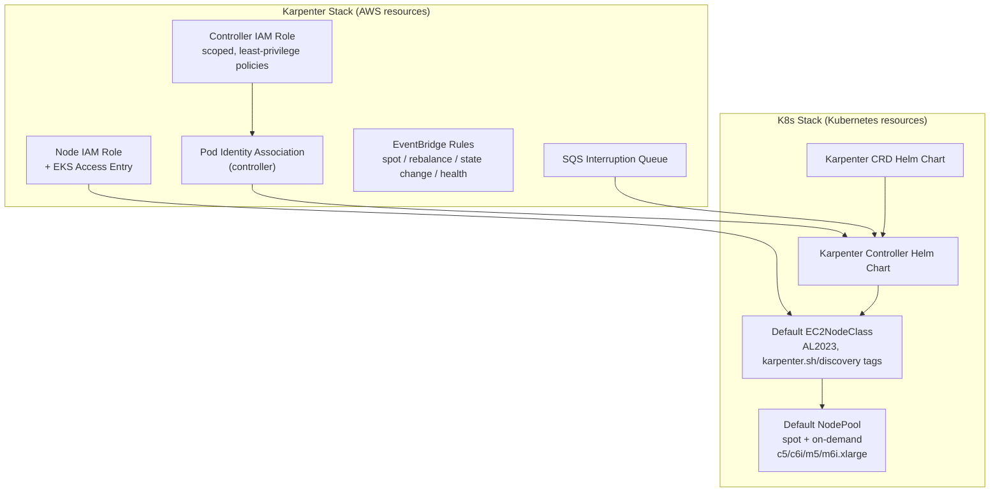

# Karpenter: Autoscaling Setup

Karpenter setup is split across two stacks — a deliberate separation between
**IAM/AWS resources** (Karpenter Stack) and **Kubernetes resources** (K8s
Stack) — following the pattern in the
[official Karpenter CloudFormation template](https://github.com/aws/karpenter-provider-aws).

## Why interruption handling matters

Spot instances can be reclaimed by AWS with **2 minutes' notice**. The SQS
queue plus EventBridge rules (spot interruption, rebalance recommendation,
instance state change, health events) let Karpenter **drain and replace
nodes proactively** instead of losing pods ungracefully. This is the
mechanism, not an optional extra — running Karpenter on spot without it
means workloads get killed with no warning.

## Default NodePool shape

Out of the box, the K8s Stack deploys a NodePool that mixes:

- **Capacity types**: spot + on-demand (Karpenter picks the cheapest
  available spot capacity, falling back to on-demand)
- **Instance families**: `c5`, `c6i`, `m5`, `m6i` at `.xlarge`

This is a reasonable general-purpose starting point. Teams typically layer
additional NodePools on top for specialized workloads (GPU, memory-optimized,
etc.) once they know their workload shape.

## Why Pod Identity, and why before addons

Pod Identity associations are created **before** the addons that need them.
If a pod identity mapping doesn't exist yet when a CSI driver or the
Karpenter controller starts, it can hit a **credential race condition** —
starting up without permissions and either crash-looping or silently failing
API calls until the association is picked up. Ordering the stacks so IAM/Pod
Identity exists first avoids that entirely.

Next: [GitFlow Workflow →](/gitflow-workflow)
