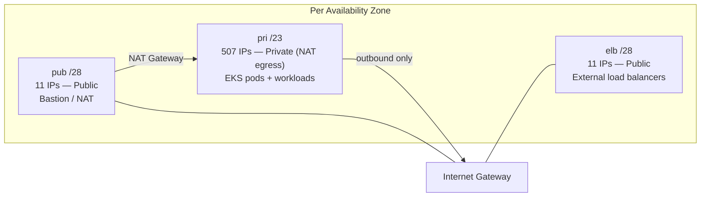
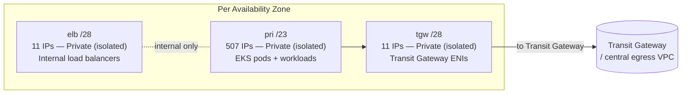

# VPC Subnet Layout

The VPC stack supports two egress modes, chosen per-environment via
`vpcEgressMode`: `nat-gateway` or `transit-gateway`. Both use a `/21` VPC,
split per Availability Zone.

## NAT Gateway mode



Public subnets exist, an Internet Gateway is attached, and workloads reach
the internet through a NAT Gateway in the public subnet. This is the
familiar default for most standalone VPCs.

## Transit Gateway mode



**No public subnets, no Internet Gateway.** All traffic — inbound and
outbound — routes through the Transit Gateway. Load balancers created in the
`elb` subnet are necessarily internal.

## Choosing between them

| | NAT Gateway | Transit Gateway |
|---|---|---|
| Setup complexity | Lower — self-contained | Higher — needs a shared TGW/egress VPC already in place |
| Cost | NAT Gateway data processing charges per VPC | Centralized egress, often cheaper at scale |
| Typical use | Standalone accounts, early environments | Multi-account landing zones with centralized network control |
| Internet-facing load balancers | Supported | Not supported (everything is internal) |

This project uses exactly that split: `feature`/`dev` run `nat-gateway`,
`stag`/`prod` run `transit-gateway` — a per-environment config choice, not a
code change.

## How the Transit Gateway is found

In `transit-gateway` mode, the VPC stack doesn't take a hardcoded TGW ID.
Instead it looks one up **at deploy time** via an `AwsCustomResource` that
calls `ec2:DescribeTransitGateways`, filtered by tags:

```typescript
tgwLookupTags: { Owner: 'chilim', Name: 'rnv-tgw' },
```

This means the actual Transit Gateway can be recreated, replaced, or live in
a completely different account's shared networking stack, and this project
will still find it correctly as long as the tags match — no ID to update by
hand when infrastructure changes upstream.

Next: [Karpenter →](/karpenter)
