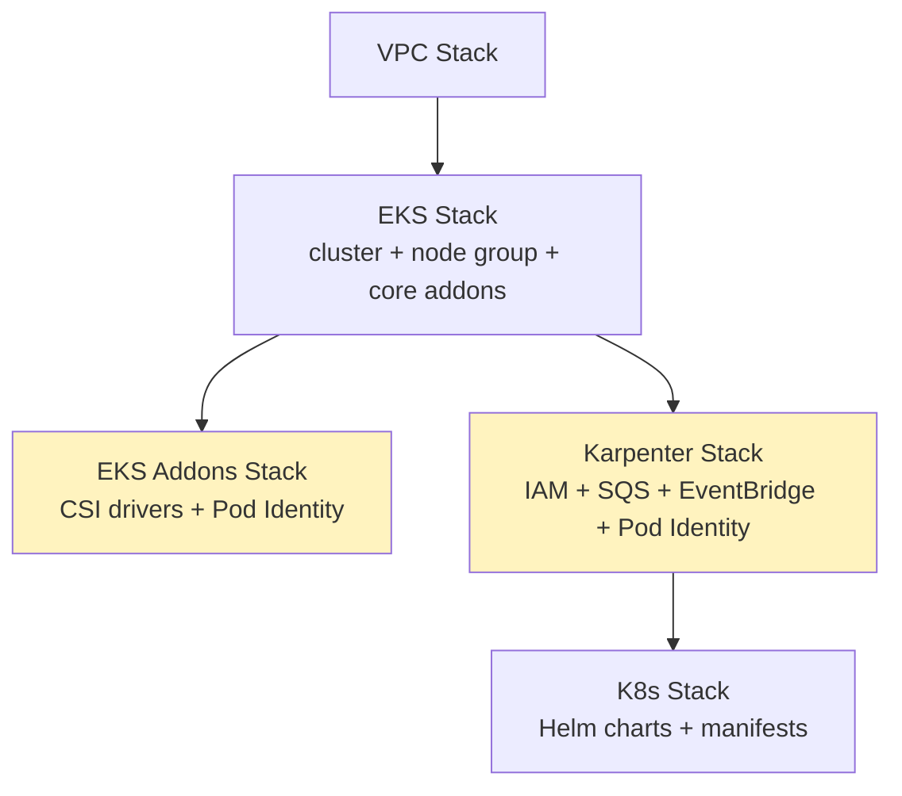

# Stack Deployment Order & Dependencies



## Why this order

- **VPC before EKS** — obviously, the cluster needs subnets to launch into.
- **EKS Addons and Karpenter are independent of each other** — both depend
  only on the EKS cluster, not on one another. They can deploy in parallel.
- **K8s stack depends on Karpenter**, specifically because the Karpenter Helm
  chart's values need the **IAM role ARN and SQS queue URL** that the
  Karpenter stack creates. Without that dependency, CDK might try to deploy
  the Helm release before the resources it references exist.

## Why the K8s stack uses `fromClusterAttributes`

The K8s stack doesn't receive the cluster object directly from the EKS
stack's construct tree. Instead it re-imports the cluster via
`eks.Cluster.fromClusterAttributes(...)`. The practical effect:

> If a Helm chart or manifest fails to apply, **only the K8s stack rolls
> back** — not the EKS cluster itself.

That's an important safety property. A bad Helm values file or a typo in a
manifest shouldn't be able to put your actual EKS cluster resource into a
rollback loop. It isolates "did the cluster provision correctly" from "did
the software we put on it apply correctly."

## Approval gates line up with stack boundaries

For environments with `requireApproval: true`, each stack gets its own
changeset review:

```
Prepare VPC → Approve VPC → Deploy VPC
Prepare EKS → Approve EKS → Deploy EKS
Prepare K8s → Approve K8s → Deploy K8s
```

Notice **EKS Addons and Karpenter deploy without a separate approval step**.
The reasoning: they're additive, IAM/infra-scoped changes with a
well-understood blast radius (CSI drivers, Pod Identity associations, an SQS
queue) — not changes to the cluster's core compute or its Kubernetes
workloads. Reserving manual approval for VPC, EKS, and K8s keeps the
approval burden on the changes most likely to be disruptive.

Next: [Networking →](/networking)
